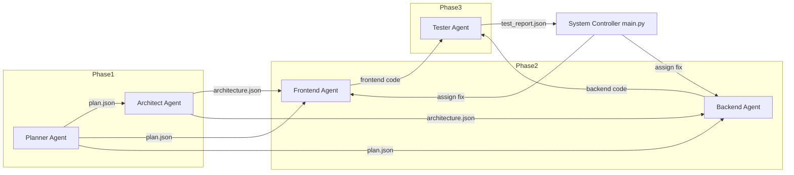
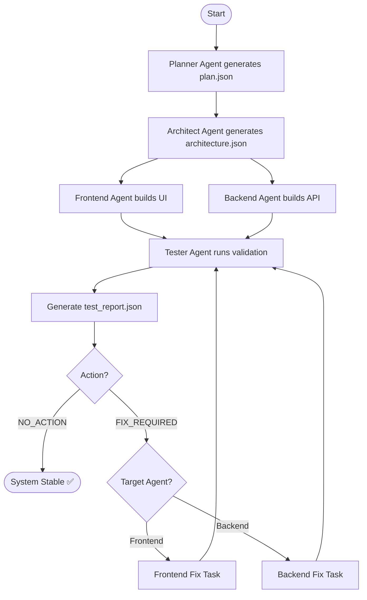

# Multi-Agent Calculator Web-based System

A multi-agent web-based system for solving mathematical problems using **CrewAI orchestration** and **Google Gemini (Flash)**. The system adopts a document-centric workflow, where agents collaborate by generating, sharing, and processing files as intermediate results.

With integrated **file tools**, each agent can read outputs from other agents and act upon them, enabling a transparent and modular pipeline of reasoning. This allows complex problems to be solved through structured, document-driven interactions rather than isolated computations.

This foundation also opens the path for future enhancements such as Retrieval-Augmented Generation (RAG), where accumulated documents can evolve into a reusable knowledge base.

---

## Key Features

### Phased Multi-Agent Workflow

The system follows a structured pipeline inspired by the software development lifecycle:

1. **Planning & Architecture** : problem analysis and solution design
2. **Development** : frontend and backend implementation
3. **Testing & QA (Iterative)** : validation and continuous improvement

Each phase is executed by specialized agents orchestrated via CrewAI.

### Document-Driven Collaboration (File Tools)

Agents interact through files rather than direct messaging:

1. Agents **generate outputs as documents**
2. Other agents **read and process those documents**
3. Files act as **intermediate state and communication layer**

This enables a transparent and modular workflow, where every step is explicitly recorded and can be inspected or reused.

### Self-Improving Loop

The system implements an automated feedback loop:

1. The **tester agent** generates a structured test report (JSON)
2. The system analyzes:
    - detected issues
    - responsible agent
    - reasoning behind the issue
3. A **dynamic fixing task** is created and assigned to the appropriate agent
4. The process **repeats until no issues remain**

This allows the system to **iteratively refine its own output** without manual intervention.

### Targeted Agent Execution

Bug fixing is handled by the most relevant agent:

1. Frontend issues : frontend agent
2. Backend issues : backend agent

This ensures efficient and context-aware improvements, quite similar to real-world development teams.

### Dynamic Task Generation

Tasks are not static. The system can:

1. Generate new tasks at runtime
2. Adapt instructions based on testing results
3. Enforce constraints (e.g., full file overwrite for code updates)

This makes the workflow **adaptive and intelligent**.

### File-Based State Management

All critical outputs (e.g., test reports) are stored as files:

1. Acts as a **single source of truth**
2. Enables **traceability and debugging**
3. Supports **cross-agent data sharing**

### RAG-Ready Architecture (Future Work)

The document-centric design provides a natural path toward **Retrieval-Augmented Generation (RAG)**:

1. Generated files can evolve into a knowledge base
2. Agents can retrieve and reuse past results
3. Enables more context-aware and scalable reasoning

---

## Key Concepts Implemented 
 
1. Multi-Agent Systems (MAS)  
2. Agent Orchestration (CrewAI)  
3. Document-Centric Collaboration (File-Based Interaction)  
4. Tool-Augmented AI (File Tools Integration)  
5. Dynamic Task Generation  
6. Self-Improving Feedback Loop  
7. Structured Output Enforcement  

---

## Known Limitations

1. Still relies on LLM-based reasoning, which may produce hallucinations in edge cases  
2. Requires well-structured inputs and intermediate documents (e.g., JSON reports)  
3. No strict validation layer for agent outputs yet (schema or semantic validation)  
4. Sensitive to file integrity and agent coordination consistency   

---

## Architecture

## Architecture

The system is built as a **document-driven multi-agent architecture** orchestrated using CrewAI. Each agent operates with a clearly defined responsibility and collaborates through **file-based artifacts**, enabling a structured and traceable workflow.

### Core Principles

1. Separation of concerns across agents  
2. Document-centric communication via files  
3. Structured outputs (JSON-based)  
4. Iterative self-improving loop  

---

## Agents & Responsibilities

### Planner Agent
1. Produces a **structured planning document** (plan.json)
2. Defines:
    - problem scope
    - user personas
    - features & roadmap
    - use cases and user flow
3. Strictly focuses on **WHAT to build** (no technical decisions)

### Architect Agent
1. Reads document produced by planner agent (plan.json)
2. Produces a **structured architecture document** (architecture.json)
3. Defines:
    - system architecture (layers, modules)
    - data flow & state design
    - tech stack & API specification
4. Focuses on **HOW to build the system**

### Frontend Agent
1. Reads planning and architecture documents
2. Generates frontend code (single HTML file with embedded CSS & JS)
3. Responsibilities:
    - implement UI & user flow
    - follow API contract strictly

### 4. Backend Agent
1. Reads planning and architecture documents
2. Generates backend service (single file: .py or .js)
3. Responsibilities:
    - API implementation
    - calculation logic
    - error handling

### 5. Tester Agent
1. Reads:
    - planning & architecture documents
    - generated frontend & backend code
2. Produces structured test report (test_report.json)
3. Performs:
    - static code analysis (frontend)
    - unit testing via generated scripts (backend)
    - functional & edge case validation
4. Outputs test summary and bug reports

---

## Workflow

1. Planner and Architect define the solution  
2. Frontend and Backend agents implement the system  
3. Tester agent evaluates and generates a report  
4. System analyzes the report and assigns fixes  
5. The loop continues until no issues remain  

---

## Project Structure

multi-agent-calculator/
│
├── agents/            # Agent definitions
├── tools/             # Custom tools (file, execution, etc.)
├── tasks.py           # Task definitions
├── llm.py             # LLM configuration
├── config.py          # Environment config
├── main.py            # Entry point
├── test_llm.py        # LLM test
├── .env               # API Key (ignored)
└── README.md

---

## Environment Setup

Create `.env` file:

GOOGLE_API_KEY=your_google_api_key

---

## Installation

# Clone repository
git clone https://github.com/AlifBata84/multi-agent-calculator.git

cd multi-agent-calculator

# Create virtual environment
python -m venv venv
source venv/bin/activate

# Install dependencies
pip install -r requirements.txt

---

## Usage 

Ensure that the `workspace/` folder is empty before running, as it stores all intermediate artifacts generated by agents.

Run the system:
python main.py

---

## LLM Testing 

Run the test : 
python test_llm.py

---

## Developer

Alif Finandhita

